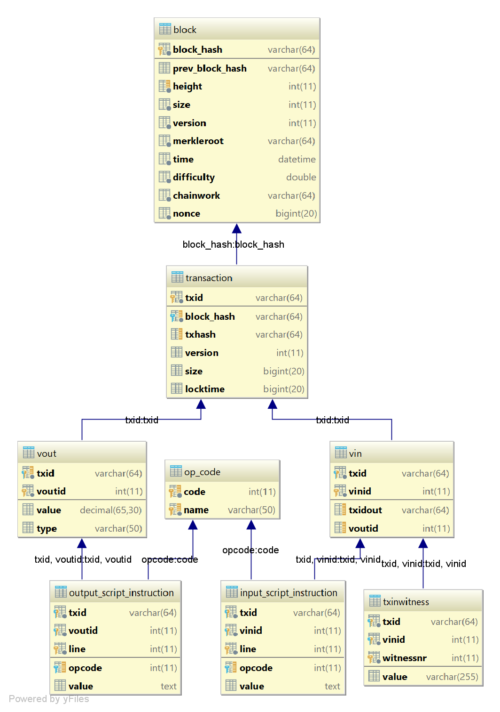

# blockchain2sqldatabase

Blockchain 2 SQL Database is a project to import the blockchain into a SQL database. 
It uses the RPC Functionality of the Bitcoin Core Client and is designed to write into a MariaDB.

## Running Guide
To start the Project you need to follow those steps:
### Bitcoin Core Client
Download Bitcoin Core Client.

Run the command in bitcoinConfig\start.bat (adjust path to config as needed)

Maybe adjust username / password in the config file.

### MariaDB
Run the sql querries from sql/tables.sql

### Change Configuration
Adjust username and password of database connection in constructor of DatabaseConnector as needed.

Adjust username and password of bitcoinRPCUrl in constructor of BlockchainLoader as needed.

## Schema
The DB Schema is intended to reflect the easiest version of how you can get the blockchain into a relational model. 
The Bitcoin scripts are split and stored by OP_Code or value.

